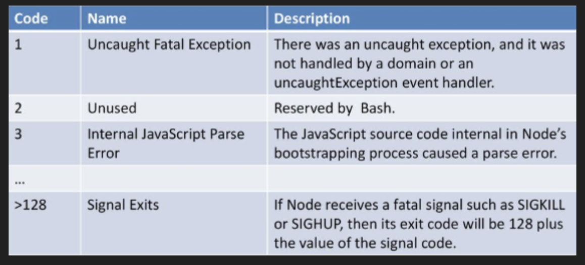

## I. Interacting with File System

1. **fs** module:
    + Node applications perform file I/O via the fs module, a core module whose methods provide wrappers around standard file system
    + **Wrappers** around **POSIX** function
        + *rename* 
        + *truncate*
        + *chmod*
        + *unlink*
        + *rmdir*
        + *mkdir*
        + *close*
        + *open*
        + *readFile*
        + *writeFile*
        + *appendFile*
    + Stream functions:
        + *fs.createReadStream()*
        + *fs.createWriteStream()*
    + Watch a file:
        + *fs.watch()* - returns a fs.FsWatcher
        + *'change' event*: the type of change and filename that changed 
        + *'error' event*
## II. Process Object:

+ Global object that provides information about and control over the current runing Node.js process
+ Refers to  for more information about process methods and properties
+ *Exit codes*: normal exits with 0 indicating when no more async operations are pending
    
    
+ **Streams**:
```javascript
process.stdin.resume();
process.stdin.setEncoding('utf8')

process.stdin.on('data', (chunk) => {
    process.stdout.write(`Data! -> ${chunk}`);
})

process.stdin.on('end', () => {
    process.stderr.write('End')
});

```
    
## III. Scalability:

+ Typical OS has different processes running in the background
+ Each process is being managed by a single-core of our CPU
+ Take full advantage of CPU, we would need number of processes that equals number of cores in CPU

## IV. Single Process Limitations:

+ Single-threaded, non-blocking performance in Node works great for single process

+ Eventually, one process in one CPU is not enough to handle increased workload

+ Node.js runs in a single thread, but it doesn't mean we cannot have multiple processes and multiple machines

+ *Multi-processing*: adding more number of CPUs to system which increases the computing speed

+ *Multi-threading*: allowing single process to create more threads which increase responsiveness of the system

## V. Child Processes:

+ *child_process* module provides ability to spawn child processes

+ *child_process* module enables access OS functionalities by running any system command inside a child process

+ **shell**: 
    + CLI interpreter or shell that provides a CLI
    + Bash is the command in shell
    + Node provides us with a function that will span an instance of bash and execute the given command
   

+ 4 different ways to create a child:
    + *spawn(command, args, options)*: launches a command in a **new process* and we can use to it to pass that command any arguments 

    + *fork()*: specialized version of **spawn()** and adds addition send function and message event to facilitate message passing between parent and child. The communication channel is ICP
    + *exec(command, options, callback)*: provided command in a shell, less efficient with large file
    + *execFile()*: Similar to exec() but instead of launching a process and executing the command, the file paramter is executed directly
    
+ *Events and Streams*:
    + *exit*:
    + *disconnect*:
    + *error*:
    + *close*:
    + *message*: emitted when child uses **process.send()**. 
    + Every child has stdio streams: *child.stdin*, *child.stdout*, *child.stderr*
    